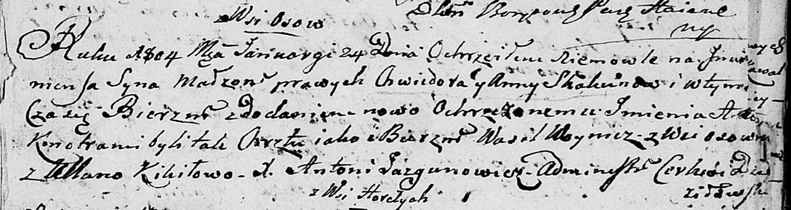

**Скакун Клеменс? Хведоров (Skakun Klemens? Antoni)**

24 января 1804 г -- крещение (НИАБ 136-13-893, лист 53, №3/1804-р
(ориг))

**НИАБ 136-13-894:** Лист 53. **Метрическая запись №3/1804-р (ориг).**

Дедиловичская Покровская церковь. 24 января 1804 года. Метрическая
запись о крещении.

Skakun Klemens? Antoni -- сын родителей с деревни Осовo.

Skakun Chwiedor -- отец.

Skakunowa Anna -- мать.

Woynicz Wasil -- кум, с деревни Осовo.

Kikiłowa Ullana -- кума.

Jazgunowicz Antoni -- ксёндз.
