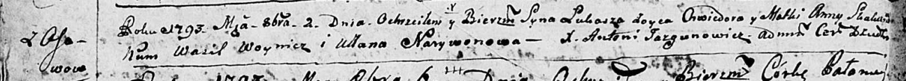

**Скакун Лука Хведоров (Skakun Łukasz)**

2 октября 1793 г -- крещение (НИАБ 136-13-893, лист 20об, №68/1793-р
(ориг), (РГИА 823-2-18, лист 248, №37/1793-р (коп)))

Лист 20-об. **Метрическая запись №68/1793-р (ориг).**

Дедиловичская Покровская церковь. 2 октября 1793 года. Метрическая
запись о крещении.

Skakun Łukasz -- сын родителей с деревни Осовo.

Skakun Chwiedor -- отец.

Skakunicha Anna-- мать.

Woynicz Wasil - кум.

Narywonowa Ullana - кума.

Jazgunowicz Antoni -- ксёндз.

**РГИА 823-2-18:** Лист 248. **Метрическая запись №37/1793-р (коп).**

Дедиловичская Покровская церковь. 2 октября 1793 года. Метрическая
запись о крещении.

Skakun Łukasz -- сын родителей с деревни Осово.

Skakun Chwiedor -- отец.

Skakunowa Anna -- мать.

Woynicz Wasil -- кум.

Narywonowa Ullana -- кума.

Jazgunowicz Antoni -- ксёндз.
