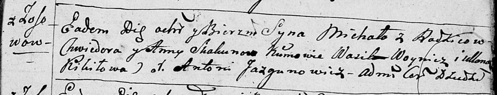

**Скакун Михал Хведоров (Skakun Michał)**

6 октября 1796 г -- крещение (НИАБ 136-13-893, лист 31, №91/1796-р
(ориг)), (РГИА 823-2-18, лист 257об, №54/1796-р (коп)).

**НИАБ 136-13-894:** Лист 31. **Метрическая запись №91/1796-р (ориг).**

Дедиловичская Покровская церковь. 6 октября 1796 года. Метрическая
запись о крещении.

Skakun Michał -- сын родителей с деревни Осовo.

Skakun Chwiedor -- отец.

Skakunowa Anna -- мать.

Woynicz Wasil -- кум.

Kikiłowa Ullana - кума.

Jazgunowicz Antoni -- ксёндз.

**РГИА 823-2-18:** Лист 257об. **Метрическая запись №54/1796-р (коп).**

Дедиловичская Покровская церковь. 19 октября 1796 года. Метрическая
запись о крещении.

Skakun Michał -- сын родителей с деревни Осово.

Skakun Chwiedor -- отец.

Skakunowa Anna -- мать.

Woynicz Wasil -- кум.

Kikiłowa Uljana -- кума.

Jazgunowicz Antoni -- ксёндз.
