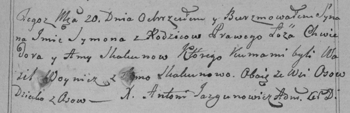

**Скакун Сымон Хведоров (Skakun Symon)**

20 ноября 1799 г -- крещение (НИАБ 136-13-893, лист 40, №48/1799-р
(ориг)), (РГИА 823-2-18, лист 273, №47/1799-р (коп)).

**НИАБ 136-13-894:** Лист 40. **Метрическая запись №48/1799-р (ориг).**

Дедиловичская Покровская церковь. 20 ноября 1799 года. Метрическая
запись о крещении.

Skakun Symon -- сын родителей с деревни Осовo.

Skakun Chwiedor -- отец.

Skakunowa Anna -- мать.

Woynicz Wasil -- кум, с деревни Осовo.

Skakunowa Anna -- кума, с деревни Осовo.

Jazgunowicz Antoni -- ксёндз.

**РГИА 823-2-18:** Лист 273. **Метрическая запись №47/1799-р (коп).**

Дедиловичская Покровская церковь. 20 ноября 1799 года. Метрическая
запись о крещении.

Skakun Symon -- сын родителей с деревни Осово.

Skakun Chwiedor -- отец.

Skakunowa Anna -- мать.

Woynicz Wasil -- кум, с деревни Осово.

Skakunowa Anna -- кума, с деревни Осово.

Jazgunowicz Antoni -- ксёндз.
