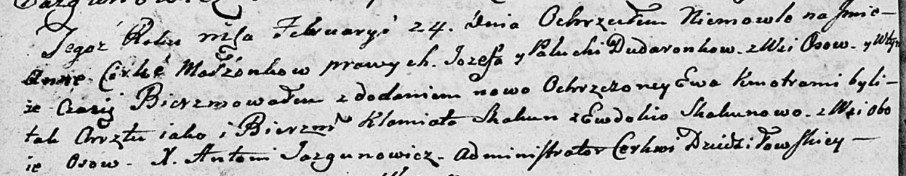

**Скакун (Скакун) Евдокия (Skakunowa (Skakunowna) Ewdokija)**

16 октября 1798 г -- венчание с Хведором Скакуном с деревни Осово (НИАБ
136-13-920, лист 6, №10/1798-б (ориг))

29 декабря 1802 г -- крещение дочери Мелании Анны (НИАБ 136-13-893, лист
45об, №36/1801-р (ориг))

24 февраля 1803 г -- крестная мать Анны Евы, дочери Дударёнков Иосифа и
Палюхи с деревни Осово (НИАБ 136-13-894, лист 49об, №7/1803-р (ориг)).

16 декабря 1806 г -- крестная мать Данилы Себестыана, дочери Дударёнков
Иосифа и Палюхи с деревни Осово (НИАБ 136-13-894, лист 61об, №52/1806-р
(ориг)).

27 января 1807 г -- крещение сына Грыгора Макара (НИАБ 136-13-893, лист
61об, №3/1807-р (ориг))

**НИАБ 136-13-920:** Лист 6. **Метрическая запись №10/1798-б (ориг).**

{width="6.496527777777778in"
height="1.4449398512685914in"}

Дедиловичская Покровская церковь. 16 октября 1798 года. Метрическая
запись о венчании.

Skakun Chwiedor -- жених с деревни \[Осово\].

Skakunowna Ewdokija -- невеста.

Kawal Sialuta -- свидетель.

Skakun Auchim -- свидетель.

Jazgunowicz Antoni -- ксёндз.

**НИАБ 136-13-894:** Лист 45об. **Метрическая запись №36/1801-р
(ориг).**

{width="6.496527777777778in"
height="3.011240157480315in"}

Дедиловичская Покровская церковь. 29 декабря 1801 года. Метрическая
запись о крещении.

Skakunowna Mełania Anna -- дочь родителей с деревни Осовo.

Skakun Chwiedor -- отец.

Skakunowa Ewdokija -- мать.

Axiuta Andrzey -- кум.

Skakunowa Maryia -- кума.

Jazgunowicz Antoni -- ксёндз.

**НИАБ 136-13-894:** Лист 49об. **Метрическая запись №7/1803-р (ориг).**

{width="6.496527777777778in"
height="1.2719488188976378in"}

Дедиловичская Покровская церковь. 24 февраля 1803 года. Метрическая
запись о крещении.

Dudaronkowna Anna Ewa -- дочь родителей с деревни Осово.

Dudaronek Jozef -- отец.

Dudaronkowa Palucha -- мать.

Skakun Klamiato -- кум, с деревни Осово.

Skakunowa Ewdokija -- кума, с деревни Осово.

Jazgunowicz Antoni -- ксёндз.

**НИАБ 136-13-894:** Лист 61об. **Метрическая запись №52/1806-р
(ориг).**

{width="6.496527777777778in"
height="1.092253937007874in"}

Дедиловичская Покровская церковь. 16 декабря 1806 года. Метрическая
запись о крещении.

Dudaronek Daniło Sebestyan -- сын родителей с деревни Замосточье.

Dudaronek Jozef -- отец.

Dudaronkowa Pałanieja -- мать.

Skakun Klamiata -- кум, с деревни Осовo.

Skakunowa Ewdokia -- кума, с деревни Осовo.

Jazgunowicz Antoni -- ксёндз.

**НИАБ 136-13-894:** Лист 61об. **Метрическая запись №3/1807-р (ориг).**

{width="6.496527777777778in"
height="1.1230971128608924in"}

Дедиловичская Покровская церковь. 27 января 1807 года. Метрическая
запись о крещении.

Skakun Hryhory Makar -- сын родителей с деревни Осовo.

Skakun Chwiedor -- отец.

Skakunowa Ewdokija -- мать.

Axiuta Andrzey -- кум.

Skakunowa Marya -- кума.

Jazgunowicz Antoni -- ксёндз.
