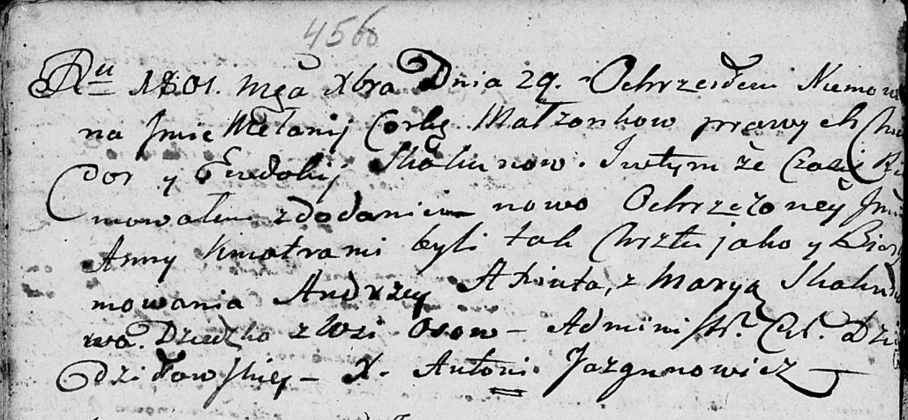

**Скакун Мелания Хведорова (Skakunowna Mełania Anna)**

29 декабря 1802 г -- крещение (НИАБ 136-13-893, лист 45об, №36/1801-р
(ориг))

**НИАБ 136-13-894:** Лист 45об. **Метрическая запись №36/1801-р
(ориг).**

Дедиловичская Покровская церковь. 29 декабря 1801 года. Метрическая
запись о крещении.

Skakunowna Mełania Anna -- дочь родителей с деревни Осовo.

Skakun Chwiedor -- отец.

Skakunowa Ewdokija -- мать.

Axiuta Andrzey -- кум.

Skakunowa Maryia -- кума.

Jazgunowicz Antoni -- ксёндз.
