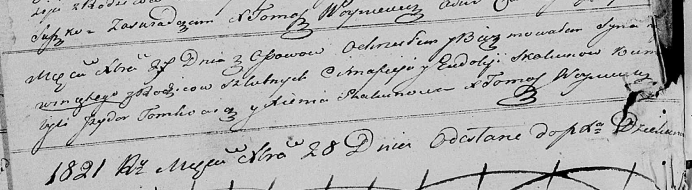

**Скакун Винценты Цимахвеев (Skakun Wincenty)**

27 декабря 1821 г -- крещение (НИАБ 136-13-894, лист 107об, №56/1821-р
(ориг)).

**НИАБ 136-13-894:** Лист 107об. **Метрическая запись №56/1821-р
(ориг).**

Осовская Покровская церковь. 27 декабря 1821 года. Метрическая запись о
крещении.

Skakun Wincenty -- сын родителей с деревни Осовo.

Skakun Cimafiey -- отец.

Skakunowa Eudokija -- мать.

Tomkowicz Jzydor -- кум.

Skakunowa Xienia -- кума.

Woyniewicz Tomasz -- ксёндз.
