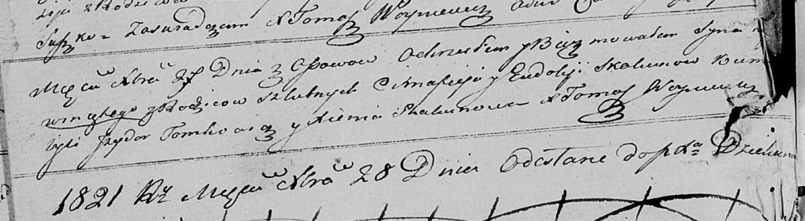

**Скакун Ева Цимахвеева (Skakunowna Ewa)**

3 ноября 1818 г -- крещение (НИАБ 136-13-894, лист 99, №35/1818-р
(ориг)).

Лист 99. **Метрическая запись №35/1818-р (ориг).**

{width="6.496527777777778in"
height="0.9849726596675416in"}

Осовская Покровская церковь. 3 ноября 1818 года. Метрическая запись о
крещении.

Skakunowna Ewa -- дочь родителей с деревни Осовo.

Skakun Cimofiej -- отец.

Skakunowa Eudokija -- мать.

Tomkowicz Jzydor -- кум.

Skakunowa Xienia -- кума.

Woyniewicz Tomasz -- ксёндз.
