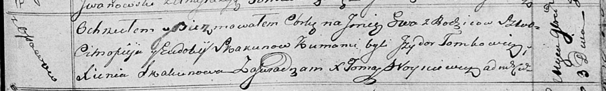

**Скакун (Чапляй) Евдокия (Skakunowa (Czaplaiowa) Eudokija)**

17 января 1798 г -- венчание с Цимахвеем Скакуном с деревни Осово (НИАБ
136-13-920, лист 5, №2/1798-б (ориг)).

15 июля 1815 г -- крещение сына Ильи (НИАБ 136-13-894, лист 92об,
№30/1815-р (ориг)).

3 ноября 1818 г -- крещение дочери Евы (НИАБ 136-13-894, лист 99,
№35/1818-р (ориг)).

27 декабря 1821 г -- крещение сына Винцентыя (НИАБ 136-13-894, лист
107об, №56/1821-р (ориг)).

**НИАБ 136-13-920:** Лист 5. **Метрическая запись №2/1798-б (ориг).**

{width="6.496527777777778in"
height="1.8351738845144356in"}

Дедиловичская Покровская церковь. 17 января 1798 года. Метрическая
запись о венчании.

Skakun Cimachwiey -- жених, с деревни Осовo.

Czaplaiowa Edokia -- невеста, с деревни Заречье.

Skakun Chwiedor -- свидетель.

Czaplay Janka -- свидетель.

Jazgunowicz Antoni -- ксёндз.

**НИАБ 136-13-894:** Лист 92об. **Метрическая запись №30/1815-р
(ориг).**

{width="6.496527777777778in"
height="0.9796084864391951in"}

Осовская Покровская церковь. 15 июня 1815 года. Метрическая запись о
крещении.

Skakun Eliasz -- сын родителей с деревни Осовo.

Skakun Cimachwiey -- отец.

Skakunowa Eudokija -- мать.

Tomkowicz Jzydor -- кум.

Skakunowa Xienia -- кума.

Woyniewicz Tomasz -- ксёндз.

Лист 99. **Метрическая запись №35/1818-р (ориг).**

{width="6.496527777777778in"
height="0.9849726596675416in"}

Осовская Покровская церковь. 3 ноября 1818 года. Метрическая запись о
крещении.

Skakunowna Ewa -- дочь родителей с деревни Осовo.

Skakun Cimofiej -- отец.

Skakunowa Eudokija -- мать.

Tomkowicz Jzydor -- кум.

Skakunowa Xienia -- кума.

Woyniewicz Tomasz -- ксёндз.

**НИАБ 136-13-894:** Лист 107об. **Метрическая запись №56/1821-р
(ориг).**

{width="6.496527777777778in"
height="1.7922615923009624in"}

Осовская Покровская церковь. 27 декабря 1821 года. Метрическая запись о
крещении.

Skakun Wincenty -- сын родителей с деревни Осовo.

Skakun Cimafiey -- отец.

Skakunowa Eudokija -- мать.

Tomkowicz Jzydor -- кум.

Skakunowa Xienia -- кума.

Woyniewicz Tomasz -- ксёндз.
