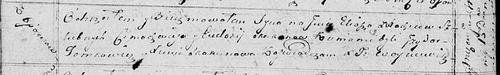

**Скакун Илья Цимахвеев (Skakun Eliasz)**

15 июля 1815 г -- крещение (НИАБ 136-13-894, лист 92об, №30/1815-р
(ориг)).

**НИАБ 136-13-894:** Лист 92об. **Метрическая запись №30/1815-р
(ориг).**

Осовская Покровская церковь. 15 июня 1815 года. Метрическая запись о
крещении.

Skakun Eliasz -- сын родителей с деревни Осовo.

Skakun Cimachwiey -- отец.

Skakunowa Eudokija -- мать.

Tomkowicz Jzydor -- кум.

Skakunowa Xienia -- кума.

Woyniewicz Tomasz -- ксёндз.
