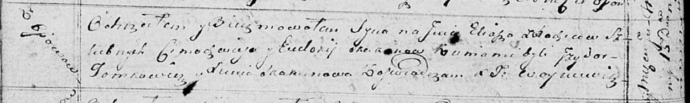

**Скакун Цимахвей (Skakun Cimachwiey, Cimofiej, Cimafiey)**

17 января 1798 г -- венчание с Евдокией Чапляй с деревни Заречье (НИАБ
136-13-920, лист 5, №2/1798-б (ориг)).

9 января 1799 г -- крестный отец Евы, дочери Гончаров Антыпа и Хадоры с
Осово (НИАБ 136-13-894, лист 38, №3/1798-р (ориг), НИАБ 136-13-938, лист
240, №3/1799-р (коп)).

10 февраля 1807 г -- крестный отец Игната Адама, сына Саладкевичей
Михалки и Агафии с Отруба (НИАБ 136-13-894, лист 38, №3/1798-р (ориг)).

9 ноября 1807 г -- свидетель венчания Кузьмы Скакуна с деревни Осово с
девкой Дарыей Чапляй с деревни Осово (НИАБ 136-13-920, лист 13,
№10/1807-б (ориг)).

31 января 1809 г -- свидетель венчания молодого Якуба Скуры с девкой
Елисаветой Скакун (НИАБ 136-13-920, лист 15, №5/1809-б (ориг)).

11 ноября 1809 г -- свидетель венчания Яна Кикило с деревни Осово с
девкой Евой Скакун с деревни Осово (НИАБ 136-13-920, лист 16, №21/1809-б
(ориг)).

15 июля 1815 г -- крещение сына Ильи (НИАБ 136-13-894, лист 92об,
№30/1815-р (ориг)).

3 ноября 1818 г -- крещение дочери Евы (НИАБ 136-13-894, лист 99,
№35/1818-р (ориг)).

27 декабря 1821 г -- крещение сына Винцентыя (НИАБ 136-13-894, лист
107об, №56/1821-р (ориг)).

**НИАБ 136-13-920:** Лист 5. **Метрическая запись №2/1798-б (ориг).**

Дедиловичская Покровская церковь. 17 января 1798 года. Метрическая
запись о венчании.

Skakun Cimachwiey -- жених, с деревни Осовo.

Czaplaiowa Edokia -- невеста, с деревни Заречье.

Skakun Chwiedor -- свидетель.

Czaplay Janka -- свидетель.

Jazgunowicz Antoni -- ксёндз.

**НИАБ 136-13-894:** Лист 38. **Метрическая запись №3/1799-р (ориг).**

Дедиловичская Покровская церковь. 9 января 1799 года. Метрическая запись
о крещении.

Hanczarowna Ewa Anna -- дочь родителей с деревни Осовo.

Hanczar Antyp -- отец.

Hanczarowa Chadora -- мать.

Skakun Cimachwey -- кум с деревни Осовo.

Woyniczowa Cecylija -- кума.

Jazgunowicz Antoni -- ксёндз.

Лист 240. **Метрическая запись №3/1799-р (коп).**

(См. тж. НИАБ 136-13-894, лист 38, №3/1799-р (ориг); РГИА 823-2-18, лист
268, №3/1799-р (коп))

Дедиловичская Покровская церковь. 9 января 1799 года. Метрическая запись
о крещении.

Hanczarowa Ewa Katerzyna -- дочь родителей с деревни Осово.

Hanczar Antyp -- отец.

Hanczarowa Chodora -- мать.

Skakun Cimachwiey -- кум, с деревни Осово.

Woyniczowa Cecylia - кума, с деревни Замосточье.

Jazgunowicz Antoni -- ксёндз.

**НИАБ 136-13-894:** Лист 62. **Метрическая запись №8/1807-р (ориг).**

Дедиловичская Покровская церковь. 10 февраля 1807 года. Метрическая
запись о крещении.

Sałatkowicz Jhnat Adam -- сын родителей с деревни Отруб.

Sałatkowicz Michałka -- отец.

Sałatkowiczowa Ahafija -- мать.

Skakun Cimachwey -- кум, с деревни Осовo.

Czaplaiowa Marya -- кума, с деревни Отруб.

Jazgunowicz Antoni -- ксёндз.

**НИАБ 136-13-920:** Лист 13. **Метрическая запись №10/1807-б (ориг).**

Дедиловичская Покровская церковь. 9 ноября 1807 года. Метрическая запись
о венчании.

Skakun Kuzma -- жених, с деревни Осовo.

Czaplaiowa Darya -- невеста, девка, с деревни Осовo.

Kowal Hryhor -- свидетель, с деревни Осовo.

Skakun Cimachwiey -- свидетель, с деревни Осовo.

Jazgunowicz Antoni -- ксёндз.

**НИАБ 136-13-920:** Лист 15. **Метрическая запись №5/1809-б (ориг).**

Дедиловичская Покровская церковь. 31 января 1809 года. Метрическая
запись о венчании.

Scura Jakub -- жених, молодой.

Skakunowa Elżbieta -- невеста, девка.

Skakun Cimachwiej -- свидетель, с деревни Осовo.

Busła Adam -- свидетель, с деревни Замосточье.

Jazgunowicz Antoni -- ксёндз.

**НИАБ 136-13-920:** Лист 16. **Метрическая запись №21/1809-б (ориг).**

Дедиловичская Покровская церковь. 11 ноября 1809 года. Метрическая
запись о венчании.

Kikiło Jan -- жених, с деревни Осовo.

Skakunowna Ewa -- невеста, девка с деревни Осовo.

Orciszewski Wincenty, JP -- свидетель, шляхтич.

Skakun Cimachwiey -- свидетель, с деревни Осовo.

Jazgunowicz Antoni -- ксёндз.

**НИАБ 136-13-894:** Лист 92об. **Метрическая запись №30/1815-р
(ориг).**

Осовская Покровская церковь. 15 июня 1815 года. Метрическая запись о
крещении.

Skakun Eliasz -- сын родителей с деревни Осовo.

Skakun Cimachwiey -- отец.

Skakunowa Eudokija -- мать.

Tomkowicz Jzydor -- кум.

Skakunowa Xienia -- кума.

Woyniewicz Tomasz -- ксёндз.

**НИАБ 136-13-894:** Лист 99. **Метрическая запись №35/1818-р (ориг).**

Осовская Покровская церковь. 3 ноября 1818 года. Метрическая запись о
крещении.

Skakunowna Ewa -- дочь родителей с деревни Осовo.

Skakun Cimofiej -- отец.

Skakunowa Eudokija -- мать.

Tomkowicz Jzydor -- кум.

Skakunowa Xienia -- кума.

Woyniewicz Tomasz -- ксёндз.

**НИАБ 136-13-894:** Лист 107об. **Метрическая запись №56/1821-р
(ориг).**

Осовская Покровская церковь. 27 декабря 1821 года. Метрическая запись о
крещении.

Skakun Wincenty -- сын родителей с деревни Осовo.

Skakun Cimafiey -- отец.

Skakunowa Eudokija -- мать.

Tomkowicz Jzydor -- кум.

Skakunowa Xienia -- кума.

Woyniewicz Tomasz -- ксёндз.
