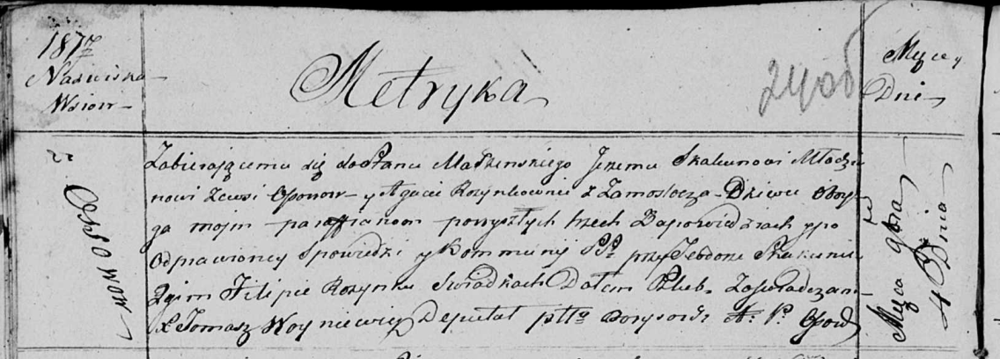

**Скакун Юрий (Skakun Jerzy)**

4 ноября 1817 г -- венчание с девкой Агатой Розынко с деревни Замосточье
(НИАБ 136-13-920, лист 24об, №8/1817-б (ориг)).

**НИАБ 136-13-920:** Лист 24об. **Метрическая запись №8/1817-б (ориг).**

Осовская Покровская церковь. 4 ноября 1817 года. Запись о венчании.

Skakun Jerzy -- жених, молодой, парафии Осовской, с деревни Осово.

Rozynkowna Agata -- невеста, девка, парафии Осовской, с деревни
Замосточье.

Skakun Teodor -- свидетель.

Rozynka Filip -- свидетель.

Woyniewicz Tomasz -- ксёндз.
