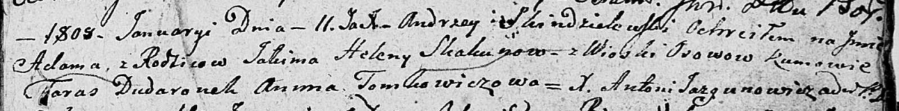

**Скакун Елена (Skakunowa Elena)**

11 января 1808 г -- крещение сына Адама (НИАБ 136-13-893, лист 64,
№4/1808-р (ориг))

**НИАБ 136-13-894:** Лист 64. **Метрическая запись №4/1808-р (ориг).**

Дедиловичская Покровская церковь. 11 января 1808 года. Метрическая
запись о крещении.

Skakun Adam -- сын родителей с деревни Осовo.

Skakun Jakim -- отец.

Skakunowa Helena -- мать.

Dudaronek Taras -- кум.

Tomkowiczowa Anna -- кума.

Jazgunowicz Antoni - ксёндз.
