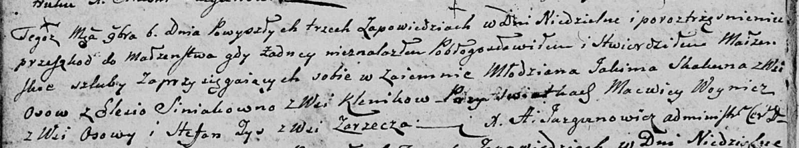
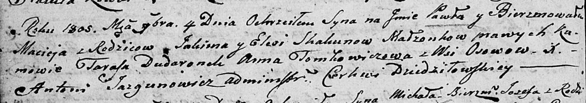

**Скакун (Синяк) Елеся (Skakunowa (Siniakowna) Elesia)**

6 ноября 1804 г -- венчание с молодым Якимом Скакуном с деревни Осово
(НИАБ 136-13-920, лист 10об, №9/1804-б (ориг))

4 ноября 1805 г -- крещение сына Павла Мацея (НИАБ 136-13-893, лист 58,
№50/1805-р (ориг))

**НИАБ 136-13-920:** Лист 10об. **Метрическая запись №9/1804-б (ориг).**

Дедиловичская Покровская церковь. 6 ноября 1804 года. Метрическая запись
о венчании.

Skakun Jakim -- жених, молодой, с деревни Осовo.

Siniakowna Elesia -- невеста, с деревни Клинники.

Woynicz Macwiey -- свидетель, с деревни Осовo.

Zys Stefan -- свидетель, с деревни Заречье.

Jazgunowicz Antoni -- ксёндз.

**НИАБ 136-13-894:** Лист 58. **Метрическая запись №50/1805-р (ориг).**

Дедиловичская Покровская церковь. 4 ноября 1805 года. Метрическая запись
о крещении.

Skakun Paweł Maciey -- сын родителей с деревни Осовo.

Skakun Jakim -- отец.

Skakunowa Elesia -- мать.

Dudaronek Taras -- кум.

Tomkowiczowa Anna -- кума.

Jazgunowicz Antoni -- ксёндз.
