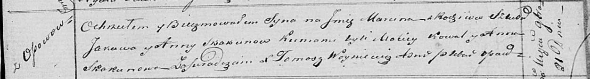

**Скакун Анна (Skakun Anna)**

21 ноября 1820 г -- крещение сына Марцина (НИАБ 136-13-893, лист 105,
№41/1820-р (ориг))

**НИАБ 136-13-894:** Лист 105. **Метрическая запись №41/1820-р (ориг).**

Осовская Покровская церковь. 21 ноября 1820 года. Метрическая запись о
крещении.

Skakun Marcin -- сын родителей с деревни Осовo.

Skakun Jakow -- отец.

Skakunowa Anna -- мать.

Kowal Maciey -- кум.

Skakunowa Anna -- кума.

Woyniewicz Tomasz -- ксёндз.
