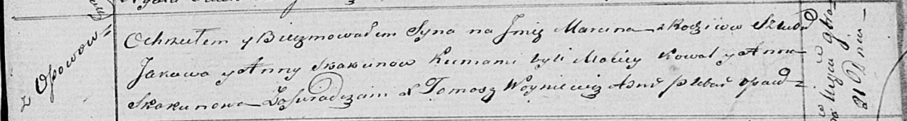
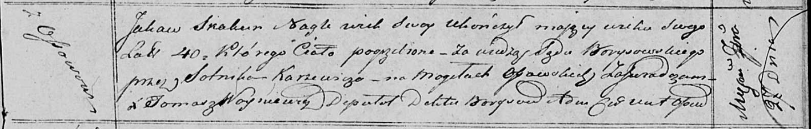

**Скакун Яков (Skakun Jakow)**

27 сентября 1820 г -- отпевание, умер в возрасте 40 лет (родился около
1780 г) (НИАБ 136-13-919, лист 34, №20/1820-у (ориг))

21 ноября 1820 г -- крещение сына Марцина (НИАБ 136-13-893, лист 105,
№41/1820-р (ориг))

**НИАБ 136-13-894:** Лист 105. **Метрическая запись №41/1820-р (ориг).**

Осовская Покровская церковь. 21 ноября 1820 года. Метрическая запись о
крещении.

Skakun Marcin -- сын родителей с деревни Осовo.

Skakun Jakow -- отец.

Skakunowa Anna -- мать.

Kowal Maciey -- кум.

Skakunowa Anna -- кума.

Woyniewicz Tomasz -- ксёндз.

**НИАБ 136-13-919:** Лист 34. **Метрическая запись №20/1820-у (ориг).**

Осовская униатская церковь. 27 сентября 1820 года. Метрическая запись об
отпевании.

Skakun Jakaw -- умер внезапно, 40 лет, с деревни Осово, умер при
свидетеле сотнике Каржевиче (Karżewicz), похоронен на кладбище деревни
Осово.

Woyniewicz Tomasz -- ксёндз.
