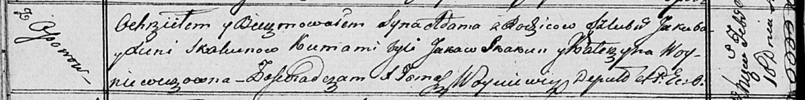

**Скакун Адам Якубов (Skakun Adam)**

10 февраля 1817 г -- крещение (НИАБ 136-13-893, лист 95об, №11/1817-р
(ориг))

**НИАБ 136-13-894:** Лист 95об. **Метрическая запись №11/1817-р
(ориг).**

Осовская Покровская церковь. 10 февраля 1817 года. Метрическая запись о
крещении.

Skakun Adam -- сын родителей с деревни Осовo.

Skakun Jakub -- отец.

Skakunowa Xienia -- мать.

Skakun Jakaw -- кум.

Woyniewiczowna Katerzyna -- кума.

Woyniewicz Tomasz -- ксёндз.
