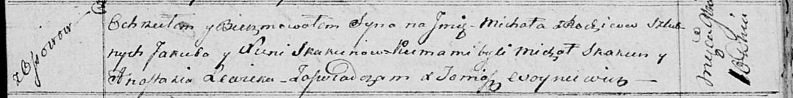

**Скакун Михал Якубов (Skakun Michał)**

10 ноября 1814 г -- крещение (НИАБ 136-13-893, лист 91, №65/1814-р
(ориг))

**НИАБ 136-13-894:** Лист 91. **Метрическая запись №65/1814-р (ориг).**

Осовская Покровская церковь. 10 ноября 1814 года. Метрическая запись о
крещении.

Skakun Michał -- сын родителей с деревни Осовo.

Skakun Jakub -- отец.

Skakunowa Xienia -- мать.

Skakun Michał -- кум.

Lewicka Anastazia -- кума.

Woyniewicz Tomasz -- ксёндз.
