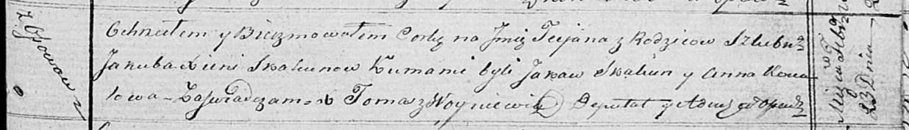

**Скакун Татьяна Якубова (Skakunowna Taciana)**

23 февраля 1819 г -- крещение (НИАБ 136-13-893, лист 100, №8/1819-р
(ориг))

**НИАБ 136-13-894:** Лист 100. **Метрическая запись №8/1819-р (ориг).**

Осовская Покровская церковь. 23 февраля 1819 года. Метрическая запись о
крещении.

Skakunowna Taciana -- дочь родителей с деревни Осовo.

Skakun Jakub -- отец.

Skakunowa Xienia -- мать.

Skakun Jakaw -- кум.

Kowalowa Anna -- кума.

Woyniewicz Tomasz -- ксёндз.
