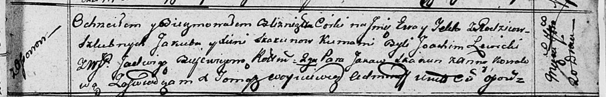

**Скакун Текля Якубова (Skakunowna Tekla)**

20 сентября 1812 г -- крещение (НИАБ 136-13-893, лист 85, №44/1812-р
(ориг))

**НИАБ 136-13-894:** Лист 85. **Метрическая запись №44/1812-р (ориг).**

{width="6.496527777777778in"
height="1.0446478565179353in"}

Осовская Покровская церковь. 20 сентября 1812 года. Метрическая запись о
крещении.

Skakunowna Ewa -- дочь родителей с деревни Осовo.

Skakunowna Tekla -- дочь родителей с деревни Осовo.

Skakun Jakub -- отец.

Skakunowa Xienia -- мать.

Lewicki Joahim -- кум.

Bujewiczowna Jadwiga, WJP -- кума, шляхтянка.

Skakun Jakow -- кум.

Kowalowa Anna -- кума.

Woyniewicz Tomasz -- ксёндз.
