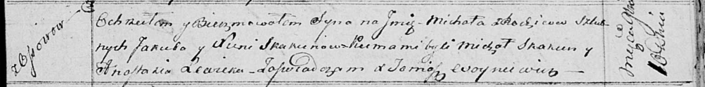

**Скакун Якуб (Skakun Jakub)**

5 февраля 1811 г -- венчание с девкой Ксеней Сушко (НИАБ 136-13-920,
лист 17об, №3/1811-б (ориг))

20 сентября 1812 г -- крещение дочерей Евы и Текли (НИАБ 136-13-893,
лист 85, №44/1812-р (ориг))

10 ноября 1814 г -- крещение сына Михала (НИАБ 136-13-893, лист 91,
№65/1814-р (ориг))

10 февраля 1817 г -- крещение сына Адама (НИАБ 136-13-893, лист 95об,
№11/1817-р (ориг))

23 февраля 1819 г -- крещение дочери Татьяны (НИАБ 136-13-893, лист 100,
№8/1819-р (ориг))

21 июня 1821 г -- крещение дочери Марии (НИАБ 136-13-893, лист 106об,
№28/1821-р (ориг))

**НИАБ 136-13-920:** Лист 17об. **Метрическая запись №3/1811-б (ориг).**

{width="6.496527777777778in"
height="1.8619936570428697in"}

Осовская Покровская церковь. 5 февраля 1811 года. Метрическая запись о
венчании.

Skakun Jakub -- жених, молодой, парафии Осовской, с деревни Осово.

Szuszkowna Xienia -- невеста, девка, парафии Осовской.

Czaplay Antoni -- свидетель.

Szuszko Wasil -- свидетель.

Woyniewicz Tomasz -- ксёндз.

**НИАБ 136-13-894:** Лист 85. **Метрическая запись №44/1812-р (ориг).**

{width="6.496527777777778in"
height="1.0446478565179353in"}

Осовская Покровская церковь. 20 сентября 1812 года. Метрическая запись о
крещении.

Skakunowna Ewa -- дочь родителей с деревни Осовo.

Skakunowna Tekla -- дочь родителей с деревни Осовo.

Skakun Jakub -- отец.

Skakunowa Xienia -- мать.

Lewicki Joahim -- кум.

Bujewiczowna Jadwiga, WJP -- кума, шляхтянка.

Skakun Jakow -- кум.

Kowalowa Anna -- кума.

Woyniewicz Tomasz -- ксёндз.

**НИАБ 136-13-894:** Лист 91. **Метрическая запись №65/1814-р (ориг).**

{width="6.496527777777778in"
height="0.8099704724409449in"}

Осовская Покровская церковь. 10 ноября 1814 года. Метрическая запись о
крещении.

Skakun Michał -- сын родителей с деревни Осовo.

Skakun Jakub -- отец.

Skakunowa Xienia -- мать.

Skakun Michał -- кум.

Lewicka Anastazia -- кума.

Woyniewicz Tomasz -- ксёндз.

**НИАБ 136-13-894:** Лист 95об. **Метрическая запись №11/1817-р
(ориг).**

{width="6.496527777777778in"
height="0.811981627296588in"}

Осовская Покровская церковь. 10 февраля 1817 года. Метрическая запись о
крещении.

Skakun Adam -- сын родителей с деревни Осовo.

Skakun Jakub -- отец.

Skakunowa Xienia -- мать.

Skakun Jakaw -- кум.

Woyniewiczowna Katerzyna -- кума.

Woyniewicz Tomasz -- ксёндз.

**НИАБ 136-13-894:** Лист 100. **Метрическая запись №8/1819-р (ориг).**

{width="6.496527777777778in"
height="0.9306616360454943in"}

Осовская Покровская церковь. 23 февраля 1819 года. Метрическая запись о
крещении.

Skakunowna Taciana -- дочь родителей с деревни Осовo.

Skakun Jakub -- отец.

Skakunowa Xienia -- мать.

Skakun Jakaw -- кум.

Kowalowa Anna -- кума.

Woyniewicz Tomasz -- ксёндз.

**НИАБ 136-13-894:** Лист 106об. **Метрическая запись №28/1821-р
(ориг).**

{width="6.496527777777778in"
height="0.7932075678040245in"}

Осовская Покровская церковь. 21 июня 1821 года. Метрическая запись о
крещении.

Skakunowna Marija -- дочь родителей с деревни Осовo.

Skakun Jakub -- отец.

Skakunowa Xienia -- мать.

Skakun Adam -- кум.

Kowalowa Anna -- кума.

Woyniewicz Tomasz -- ксёндз.

**НИАБ 136-13-894:** Лист 106об. **Метрическая запись №28/1821-р
(ориг).**

{width="6.496527777777778in"
height="0.7932075678040245in"}

Осовская Покровская церковь. 21 июня 1821 года. Метрическая запись о
крещении.

Skakunowna Marija -- дочь родителей с деревни Осовo.

Skakun Jakub -- отец.

Skakunowa Xienia -- мать.

Skakun Adam -- кум.

Kowalowa Anna -- кума.

Woyniewicz Tomasz -- ксёндз.
