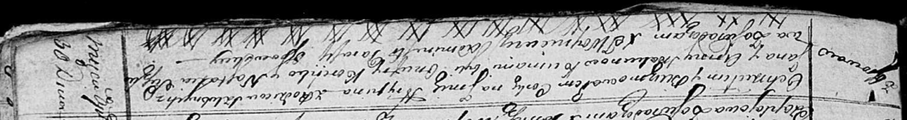

**Скакун Грыпина Янова (Skakunowna Hrypina)**

30 апреля 1817 г -- крещение (НИАБ 136-13-893, лист 96, №30/1817-р
(ориг))

**НИАБ 136-13-894:** Лист 96. **Метрическая запись №30/1817-р (ориг).**

Осовская Покровская церковь. 30 апреля 1817 года. Метрическая запись о
крещении.

Skakunowna Hrypina -- дочь родителей с деревни Осовo.

Skakun Jan -- отец.

Skakunowa Anna -- мать.

Koreńko Onufry -- кум.

Suszkowa Nastazia -- кума.

Woyniewicz Tomasz -- ксёндз.
