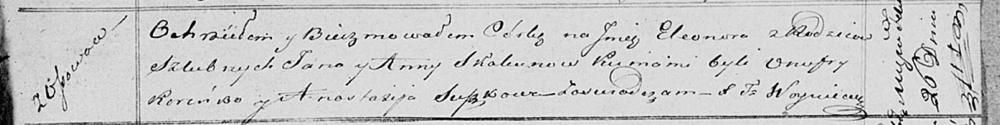

**Скакун Элеонора Янова (Skakunowna Eleonora)**

26 февраля 1821 г -- крещение (НИАБ 136-13-893, лист 106, №11/1821-р
(ориг))

**НИАБ 136-13-894:** Лист 106. **Метрическая запись №11/1821-р (ориг).**

{width="6.496527777777778in"
height="0.8173458005249343in"}

Осовская Покровская церковь. 26 февраля 1821 года. Метрическая запись о
крещении.

Skakunowna Eleonora -- дочь родителей с деревни Осовo.

Skakun Jan -- отец.

Skakunowa Anna -- мать.

Koreńko Onufry -- кум.

Suszkowa Anastazija -- кума.

Woyniewicz Tomasz -- ксёндз.
