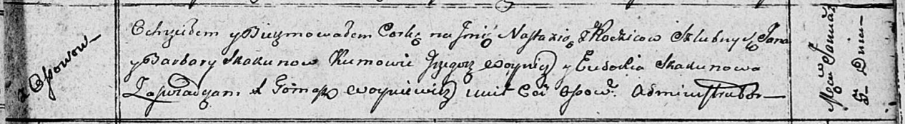

**Скакун Настасья Янова (Skakunowna Nastazya)**

5 января 1811 г -- крещение (НИАБ 136-13-893, лист 80, №2/1811-р (ориг))

**НИАБ 136-13-894:** Лист 80. **Метрическая запись №2/1811-р (ориг).**

Осовская Покровская церковь. 5 января 1811 года. Метрическая запись о
крещении.

Skakunowna Nastazya -- сын родителей с деревни Осовo.

Skakun Jan -- отец.

Skakunowa Barbara -- мать.

Woynicz Grzegorz -- кум.

Skakunowa Eudokia -- кума.

Woyniewicz Tomasz -- ксёндз.
