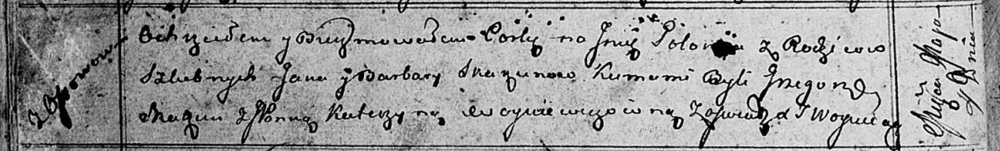

**Скакун Полония Янова (Skakunowna Połonija)**

4 мая 1813 г -- крещение (НИАБ 136-13-893, лист 86об, №14/1813-р (ориг))

**НИАБ 136-13-894:** Лист 86об. **Метрическая запись №14/1813-р
(ориг).**

{width="6.496527777777778in"
height="0.9816196412948381in"}

Осовская Покровская церковь. 4 мая 1813 года. Метрическая запись о
крещении.

Skakunowna Połonija -- дочь родителей с деревни Осовo.

Skakun Jan -- отец.

Skakunowa Barbara -- мать.

Skakun Grzegorz -- кум.

Woyniewiczowna Katerzyna, JP -- кума, шляхтянка.

Woyniewicz Tomasz -- ксёндз.
