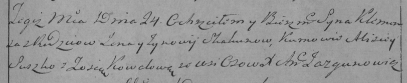
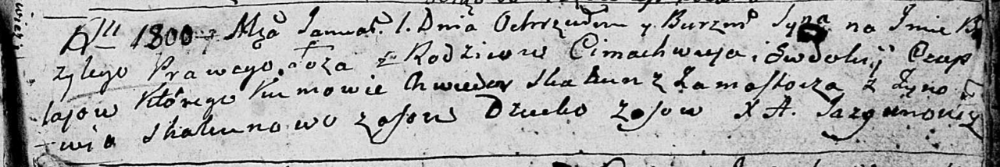
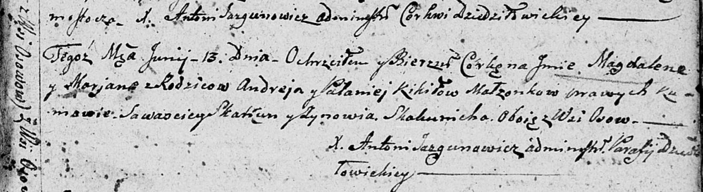
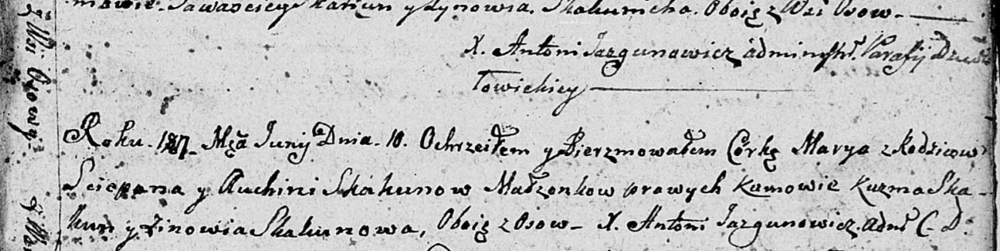

**Скакун Зыновия (Skakunowa Zynowija)**

24 ноября 1795 г -- крещение сына Клеменса (НИАБ 136-13-893, лист 26об,
№57/1795-р (ориг)), (РГИА 823-2-18, лист 254, №43/1795-р (коп))

1 января 1800 г -- возможно, крестная мать Базылия, сына Чапляев
Цимахвея и Евдокии с деревни Осово (НИАБ 136-13-894, лист 40, №1/1800-р
(ориг)).

21 августа 1804 г -- возможно, крестная мать Паланеи Агаты, дочери Кикил
Андрея и Паланеи с деревни Осово (НИАБ 136-13-894, лист 54об, №30/1804-р
(ориг)).

13 июня 1807 г -- возможно, крестная мать Магдалены Марьяны, дочери
Кикил Андрея и Паланеи с деревни Осово (НИАБ 136-13-894, лист 63,
№30/1807-р (ориг)).

10 июня 1807 г -- возможно, крестная мать Марыи, дочери Скакунов Степана
и Авхинии с деревни Осово (НИАБ 136-13-893, лист 63, №31/1807-р (ориг)).

**НИАБ 136-13-894:** Лист 26об. **Метрическая запись №57/1795-р
(ориг).**

Дедиловичская Покровская церковь. 24 ноября 1795 года. Метрическая
запись о крещении.

Skakun Klemens -- сын родителей с деревни Осовo.

Skakun \[Jan\] -- отец.

Skakunowa Zynowija -- мать.

Suszko Alisiey - кум.

Kawalowa Zosia - кума.

Jazgunowicz Antoni -- ксёндз.

**РГИА 823-2-18:** Лист 254. **Метрическая запись №43/1795-р (коп).**

Дедиловичская Покровская церковь. 24 ноября 1795 года. Метрическая
запись о крещении.

Skakun Klemens -- сын родителей с деревни Осово.

Skakun Jan -- отец.

Skakunowa Zynowija -- мать.

Suszko Alisiey -- кум.

Kowalowa Zosia -- кума.

Jazgunowicz Antoni -- ксёндз.

**НИАБ 136-13-894:** Лист 40. **Метрическая запись №1/1800-р (ориг).**

Дедиловичская Покровская церковь. 1 января 1800 года. Метрическая запись
о крещении.

Czaplay Bazyli -- сын родителей с деревни Осовo.

Czaplay Cimachwiey -- отец.

Czaplaiowa Ewdokija -- мать.

Skakun Chwiedor -- кум, с деревни Замосточье.

Skakunowa Zynowija -- кума, с деревни Осовo.

Jazgunowicz Antoni -- ксёндз.

**НИАБ 136-13-894:** Лист 54об. **Метрическая запись №30/1804-р
(ориг).**

Дедиловичская Покровская церковь. 21 августа 1804 года. Метрическая
запись о крещении.

Kikiłowna Pałanieja Agata -- дочь родителей с деревни Осовo.

Kikiło Andrzey -- отец.

Kikiłowa Pałanieja -- мать.

Skakun Sawasciey -- кум, с деревни Осовo.

Skakunowa Zynowija -- кума, с деревни Осовo.

Jazgunowicz Antoni -- ксёндз.

**НИАБ 136-13-894:** Лист 63. **Метрическая запись №30/1807-р (ориг).**

Дедиловичская Покровская церковь. 13 июня 1807 года. Метрическая запись
о крещении.

Kikiłowna Magdalena Marjana -- дочь родителей с деревни Осовo.

Kikiło Andrey -- отец.

Kikiłowa Pałanieja -- мать.

Skakun Sawasciey -- кум, с деревни Осовo.

Skakunicha Zynowija -- кума, с деревни Осовo.

Jazgunowicz Antoni -- ксёндз.

**НИАБ 136-13-894:** Лист 63. **Метрическая запись №31/1807-р (ориг).**

Дедиловичская Покровская церковь. 10 июня 1807 года. Метрическая запись
о крещении.

Skakunowna Marya -- дочь родителей с деревни Осовo.

Skakun Sciepan -- отец.

Skakunowa Auchinia -- мать.

Skakun Kuźma -- кум, с деревни Осовo.

Skakunowa Zynowia -- кума, с деревн Осовo.

Jazgunowicz Antoni -- ксёндз.
