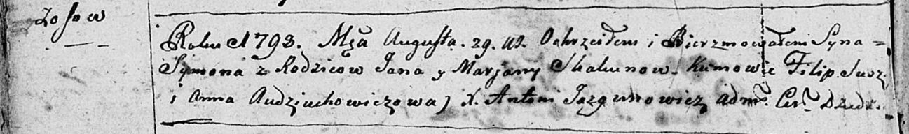

**Скакун (Сушко) Марьяна (Skakunowa, Skakunicha Marjana z Suszkow)**

20 января 1789 г -- венчание с Яном Скакуном (НИАБ 136-13-894, лист
67об, №3/1789-б (ориг)).

9 сентября 1790 г -- крещение сына Иосифа (НИАБ 136-13-894, лист 11,
№63/1790-р (ориг)).

16 января 1793 г -- крещение сына Павла (НИАБ 136-13-894, лист 18об,
№10/1793-р (ориг)), (РГИА 823-2-18, лист 246, №4/1793-р (коп)).

29 августа 1798 г -- крещение сына Сымона (НИАБ 136-13-894, лист 36об,
№39/1798-р (ориг)), (РГИА 823-2-18, лист 265, №39/1798-р (коп)).

6 января 1801 г -- крестная мать Елисаветы Катерыны, дочери Ковалёв
Леона и Марьяны с деревни Осово (НИАБ 136-13-894, лист 42об, №2/1801-р
(ориг)).

4 июня 1803 г --крестная мать Юстына Базыля, сына Ковалей Данилы и
Евдокии с деревни Осово (НИАБ 136-13-894, лист 51, №24/1803-р (ориг)).

**НИАБ 136-13-894:** Лист 67об. **Метрическая запись №3/1789-б (ориг).**

Дедиловичская Покровская церковь. 20 января 1789 года. Метрическая
запись о венчании.

Skakun Jan -- жених, с деревни Осовo.

Suszkowna Marjana -- невеста.

Suszko Jan -- свидетель.

Skakun Nikiper -- свидетель.

Jazgunowicz Antoni -- ксёндз.

**НИАБ 136-13-894:** Лист 11. **Метрическая запись №63/1790-р (ориг).**

Дедиловичская Покровская церковь. 9 сентября 1790 года. Метрическая
запись о крещении.

Skakun Jozef -- сын родителей с деревни Осово.

Skakun Jan -- отец.

Skakunowa Marjana -- мать.

Skakun Stefan - кум.

Audziuchowiczowa Fruzyna - кума.

Jazgunowicz Antoni -- ксёндз.

Лист 18-об. **Метрическая запись №10/1793-р (ориг).**

Дедиловичская Покровская церковь. 16 января 1793 года. Метрическая
запись о крещении.

Skakun Paweł -- сын родителей с деревни Осовo.

Skakun Janka -- отец.

Skakunowa Marjana -- мать.

Skakun Stefan - кум.

Busłowa Fruzyna - кума.

Jazgunowicz Antoni -- ксёндз.

**РГИА 823-2-18:** Лист 246. **Метрическая запись №4/1793-р (коп).**

Дедиловичская Покровская церковь. 16 января 1793 года. Метрическая
запись о крещении.

Skakun Paweł -- сын родителей с деревни Осово.

Skakun Janka -- отец.

Skakunowa Marjanna -- мать.

Skakun Stefan -- кум.

Busłowa Fruzyna -- кума.

Jazgunowicz Antoni -- ксёндз.

**НИАБ 136-13-894:** Лист 36об. **Метрическая запись №39/1798-р
(ориг).**

Дедиловичская Покровская церковь. 29 августа 1798 года. Метрическая
запись о крещении.

Skakun Symon -- сын родителей с деревни Осовo.

Skakun Jan -- отец.

Skakunowa Marjana -- мать.

\[Suszko\] Filip - кум.

Audziuchowiczowa Anna - кума.

Jazgunowicz Antoni -- ксёндз.

**РГИА 823-2-18:** Лист 265. **Метрическая запись №39/1798-р (коп).**

Дедиловичская Покровская церковь. 29 августа 1798 года. Метрическая
запись о крещении.

Skakun Symon -- сын родителей с деревни \[Осово\].

Skakun Jan -- отец.

Skakunowa Marjanna -- мать.

Suszko Filip -- кум.

Audziuchowiczowa Anna -- кума.

Jazgunowicz Antoni -- ксёндз.

**НИАБ 136-13-894:** Лист 42об. **Метрическая запись №2/1801-р (ориг).**

Дедиловичская Покровская церковь. 6 января 1801 года. Метрическая запись
о крещении.

Kowalowna Elżbieta Katerzyna -- дочь родителей с деревни Осовo.

Kowal Leon -- отец.

Kowalowa Marjana -- мать.

Czaplay Antoni -- кум, с деревни Осовo.

Skakunicha Marjana -- кума, с деревни Осовo.

Jazgunowicz Antoni -- ксёндз.

**НИАБ 136-13-894:** Лист 51. **Метрическая запись №24/1803-р (ориг).**

Дедиловичская Покровская церковь. 4 июня 1803 года. Метрическая запись о
крещении.

Kowal Justyn Bazyli -- сын родителей с деревни Осовo, близнец.

Kowalowna Elena Anna -- дочь родителей с деревни Осовo, близнец.

Kowal Daniła -- отец.

Kowalowa Ewdokija -- мать.

Skakun Chwiedor -- кум, крестный отец Юстына, с деревни Осовo.

Skakunowa Marjana -- кума, крестная мать Юстына, с деревни Осовo.

Skakun Joahim -- кум, крестный отец Елены, с деревни Осовo.

Woyniczowa Tekla -- кума, крестная мать Елены, с деревни Осовo.

Jazgunowicz Antoni -- ксёндз.
