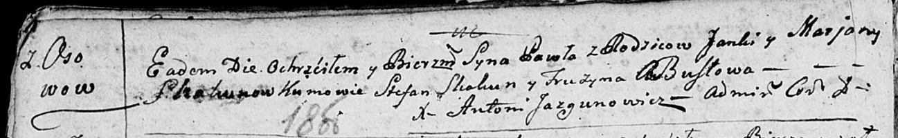
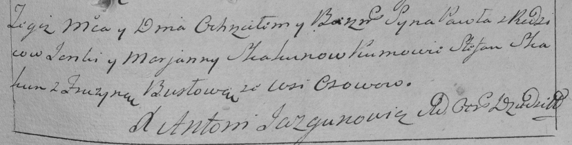

**Скакун Павел Янов (Skakun Paweł)**

16 января 1793 г -- крещение (НИАБ 136-13-894, лист 18об, №10/1793-р
(ориг)), (РГИА 823-2-18, лист 246, №4/1793-р (коп)).

Лист 18-об. **Метрическая запись №10/1793-р (ориг).**

Дедиловичская Покровская церковь. 16 января 1793 года. Метрическая
запись о крещении.

Skakun Paweł -- сын родителей с деревни Осовo.

Skakun Janka -- отец.

Skakunowa Marjana -- мать.

Skakun Stefan - кум.

Busłowa Fruzyna - кума.

Jazgunowicz Antoni -- ксёндз.

**РГИА 823-2-18:** Лист 246. **Метрическая запись №4/1793-р (коп).**

Дедиловичская Покровская церковь. 16 января 1793 года. Метрическая
запись о крещении.

Skakun Paweł -- сын родителей с деревни Осово.

Skakun Janka -- отец.

Skakunowa Marjanna -- мать.

Skakun Stefan -- кум.

Busłowa Fruzyna -- кума.

Jazgunowicz Antoni -- ксёндз.
