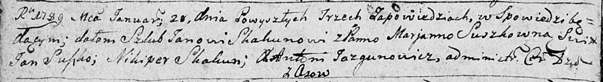
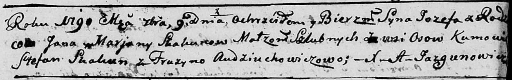
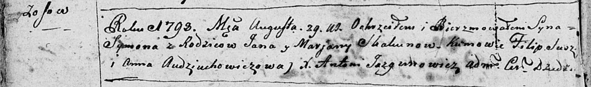
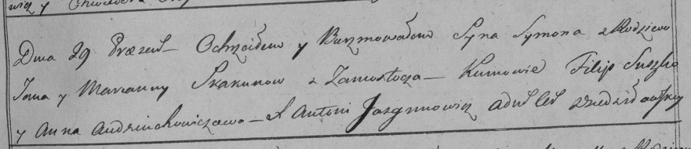

**Скакун Ян (Skakun Jan, Janka)**

20 января 1789 г -- венчание с Марьяной Сушко (НИАБ 136-13-894, лист
67об, №3/1789-б (ориг)).

9 сентября 1790 г -- крещение сына Иосифа (НИАБ 136-13-894, лист 11,
№63/1790-р (ориг)).

16 января 1793 г -- крещение сына Павла (НИАБ 136-13-894, лист 18об,
№10/1793-р (ориг)), (РГИА 823-2-18, лист 246, №4/1793-р (коп)).

29 августа 1798 г -- крещение сына Сымона (НИАБ 136-13-894, лист 36об,
№39/1798-р (ориг)), (РГИА 823-2-18, лист 265, №39/1798-р (коп)).

**НИАБ 136-13-894:** Лист 67об. **Метрическая запись №3/1789-б (ориг).**

Дедиловичская Покровская церковь. 20 января 1789 года. Метрическая
запись о венчании.

Skakun Jan -- жених, с деревни Осовo.

Suszkowna Marjana -- невеста.

Suszko Jan -- свидетель.

Skakun Nikiper -- свидетель.

Jazgunowicz Antoni -- ксёндз.

**НИАБ 136-13-894:** Лист 11. **Метрическая запись №63/1790-р (ориг).**

Дедиловичская Покровская церковь. 9 сентября 1790 года. Метрическая
запись о крещении.

Skakun Jozef -- сын родителей с деревни Осово.

Skakun Jan -- отец.

Skakunowa Marjana -- мать.

Skakun Stefan - кум.

Audziuchowiczowa Fruzyna - кума.

Jazgunowicz Antoni -- ксёндз.

**НИАБ 136-13-894:** Лист 18-об. **Метрическая запись №10/1793-р
(ориг).**

Дедиловичская Покровская церковь. 16 января 1793 года. Метрическая
запись о крещении.

Skakun Paweł -- сын родителей с деревни Осовo.

Skakun Janka -- отец.

Skakunowa Marjana -- мать.

Skakun Stefan - кум.

Busłowa Fruzyna - кума.

Jazgunowicz Antoni -- ксёндз.

**РГИА 823-2-18:** Лист 246. **Метрическая запись №4/1793-р (коп).**

Дедиловичская Покровская церковь. 16 января 1793 года. Метрическая
запись о крещении.

Skakun Paweł -- сын родителей с деревни Осово.

Skakun Janka -- отец.

Skakunowa Marjanna -- мать.

Skakun Stefan -- кум.

Busłowa Fruzyna -- кума.

Jazgunowicz Antoni -- ксёндз.

**НИАБ 136-13-894:** Лист 36об. **Метрическая запись №39/1798-р
(ориг).**

Дедиловичская Покровская церковь. 29 августа 1798 года. Метрическая
запись о крещении.

Skakun Symon -- сын родителей с деревни Осовo.

Skakun Jan -- отец.

Skakunowa Marjana -- мать.

\[Suszko\] Filip - кум.

Audziuchowiczowa Anna - кума.

Jazgunowicz Antoni -- ксёндз.

**РГИА 823-2-18:** Лист 265. **Метрическая запись №39/1798-р (коп).**

Дедиловичская Покровская церковь. 29 августа 1798 года. Метрическая
запись о крещении.

Skakun Symon -- сын родителей с деревни \[Осово\].

Skakun Jan -- отец.

Skakunowa Marjanna -- мать.

Suszko Filip -- кум.

Audziuchowiczowa Anna -- кума.

Jazgunowicz Antoni -- ксёндз.
