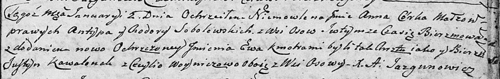

**Соболевская Анна Антыпова (Sobolewska Anna Ewa)**

2 января 1805 г -- крещение (НИАБ 136-13-894, лист 56, №4/1805-р
(ориг)).

**НИАБ 136-13-894:** Лист 56. **Метрическая запись №4/1805-р (ориг).**

{width="6.496527777777778in"
height="1.0372725284339457in"}

Дедиловичская Покровская церковь. 2 января 1805 года. Метрическая запись
о крещении.

Sobolewska Anna Ewa -- дочь родителей с деревни Осовo.

Sobolewski Antyp -- отец.

Sobolewska Chodora -- мать.

Kawalonek Justyn -- кум, с деревни Осовo.

Woyniczowa Cecylija -- кума, с деревни Осовo.

Jazgunowicz Antoni -- ксёндз.
