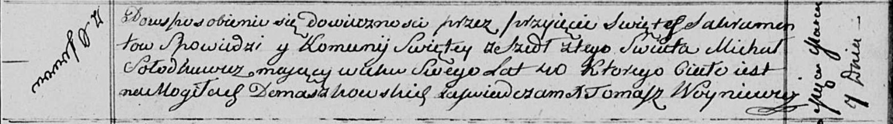

**Солодкевич Михал (Sołodkiewicz Michał)**

7 марта 1813 г -- отпевание, умер в возрасте 40 лет (родился около 1773
г) (НИАБ 136-13-919, лист 26, №20/1813-у (ориг)).

**НИАБ 136-13-919:** Лист 26. **Метрическая запись №20/1813-у (ориг).**

Осовская униатская церковь. 7 марта 1813 года. Метрическая запись об
отпевании.

Sołodkiewicz Michał -- умерший, 40 лет, с деревни Осово, похоронен на
кладбище деревни Домашковичи.

Woyniewicz Tomasz -- ксёндз.
