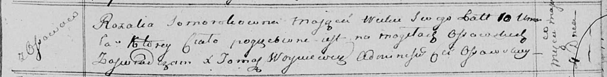

**Соморока Розалия Антонова (Somorokowna Rozalia)**

7 сентября 1802 г -- крещение (НИАБ 937-4-32, лист 7, №27/1802-р).

4 мая 1815 г -- отпевание, умерла в возрасте 10 лет (родилась около 1805
г) (НИАБ 136-13-919, лист 26, №20/1813-у (ориг)).

**НИАБ 937-4-32:** Лист 7. **Метрическая запись №27/1802-р.**

{width="6.496527777777778in"
height="0.9666666666666667in"}

Дедиловичский костел Наисвятейшего Сердца Иисуса. 7 сентября 1802 года.
Метрическая запись о крещении.

Somorokowa Rosalia -- дочь шляхтичей с деревни Осово.

Somoroka Antoni -- отец.

Somorokowa Agatha -- мать.

Bujewicz Michael -- крестный отец, шляхтич, с деревни Осово.

Slizieniowa Eleonora -- крестная мать, шляхтянка.

Linhart Hyacinthus -- ксёндз.

**НИАБ 136-13-919:** Лист 29. **Метрическая запись №15/1815-у (ориг).**

{width="6.496527777777778in"
height="0.8354166666666667in"}

Осовская униатская церковь. 4 мая 1815 года. Метрическая запись об
отпевании.

Somorokowna Rozalia -- умершая, 10 лет, с деревни Осово, похоронена на
кладбище деревни Осово.

Woyniewicz Tomasz -- ксёндз.
