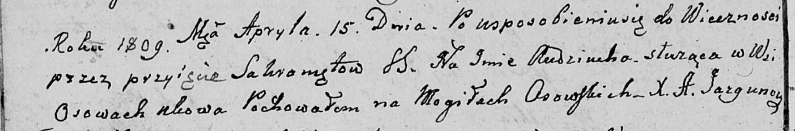

**Стуронц Авдюха (Sturąca Audziucha)**

15 апреля 1809 г -- отпевание (НИАБ 136-13-919, лист 20об, №5/1809-у
(ориг)).

**НИАБ 136-13-919:** Лист 20об. **Метрическая запись №5/1809-у (ориг).**

Дедиловичская Покровская церковь. 15 апреля 1809 года. Метрическая
запись об отпевании.

Sturąca Audziucha -- умершая, с деревни Осово, похоронена на кладбище
деревни Осово.

Jazgunowicz Antoni -- ксёндз.
