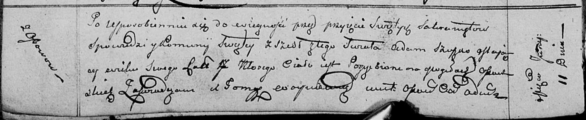

**Сушко Адам Алексеев (Suszko Adam)**

25 сентября 1788 г -- крещение (НИАБ 136-13-894, лист 5, №49/1788-р
(ориг)).

11 июня 1811 г -- отпевание, умер в возрасте 17 лет (НИАБ 136-13-919,
лист 22об, №13/1811-у (ориг)).

**НИАБ 136-13-894:** Лист 5. **Метрическая запись №49/1788-р (ориг).**

Дедиловичская Покровская церковь. 25 сентября 1788 года. Метрическая
запись о крещении.

Suszko Adam -- сын родителей с деревни Осово.

Suszko Aliexej -- отец.

Suszkowa Daryia -- мать.

Kowal Sieluta - кум.

Skakunicha Magdalena - кума.

Jazgunowicz Antoni -- ксёндз.

**НИАБ 136-13-919:** Лист 22об. **Метрическая запись №13/1811-у
(ориг).**

Осовская униатская церковь. 11 июня 1811 года. Метрическая запись об
отпевании.

Szuszko Adam -- умерший, 17 лет, с деревни Осово, похоронен на кладбище
деревни Осово.

Woyniewicz Tomasz -- ксёндз.
