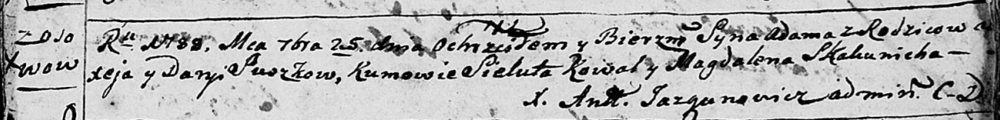

**Сушко Алексей (Suszko Alexiey)**

25 сентября 1788 г -- крещение сына Адама (НИАБ 136-13-894, лист 5,
№49/1788-р (ориг)).

**НИАБ 136-13-894:** Лист 5. **Метрическая запись №49/1788-р (ориг).**

Дедиловичская Покровская церковь. 25 сентября 1788 года. Метрическая
запись о крещении.

Suszko Adam -- сын родителей с деревни Осово.

Suszko Aliexej -- отец.

Suszkowa Daryia -- мать.

Kowal Sieluta - кум.

Skakunicha Magdalena - кума.

Jazgunowicz Antoni -- ксёндз.
