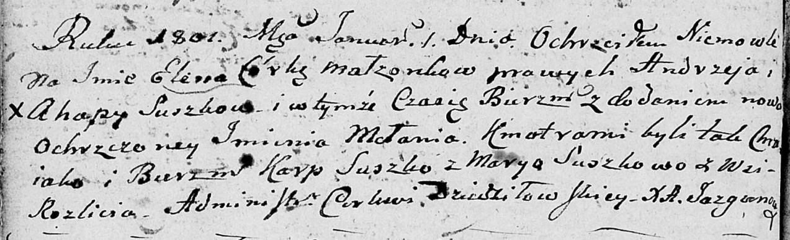

**Сушко Елена Андреева (Suszkowna Elena Mełania)**

1 января 1802 г -- крещение (НИАБ 136-13-894, лист 45об, №1/1802-р
(ориг)).

**НИАБ 136-13-894:** Лист 45об. **Метрическая запись №1/1802-р (ориг).**

Дедиловичская Покровская церковь. 1 января \[1802\] года. Метрическая
запись о крещении.

Suszkowna Elena Mełania -- дочь родителей с деревни Осовo.

Suszko Andrzey -- отец.

Suszkowa Ahapa -- мать.

Suszko Karp -- кум.

Suszkowa Maryia -- кума, с деревни Разлитье.

Jazgunowicz Antoni -- ксёндз.
