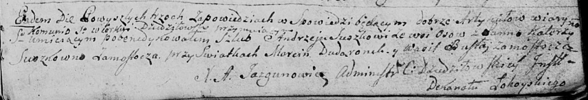

**Сушко (Сушко) Катерына (Suszkowa Katerzyna z Suszkow)**

22 октября 1794 г -- венчание с Андреем Сушко с деревни Осово (НИАБ
136-13-920, лист 1, №8/1794-б (ориг)).

**НИАБ 136-13-920:** Лист 1. **Метрическая запись №8/1794-б (ориг).**

Дедиловичская Покровская церковь. 22 октября 1794 года. Метрическая
запись о венчании.

Suszko Andrzey -- жених, деревня Осовo.

Suszkowna Katerzyna -- невеста, деревня Замосточье.

Dudaronek Marcin -- свидетель.

Busła Wasil -- свидетель, деревня Замосточье.

Jazgunowicz Antoni -- ксёндз.
