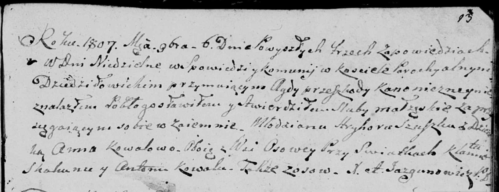

**Сушко Грыгор (Szuszko Hryhor)**

6 ноября 1807 г -- венчание с девкой Анной Коваль с деревни Осово (НИАБ
136-13-920, лист 13, №9/1807-б (ориг)).

**НИАБ 136-13-920:** Лист 13. **Метрическая запись №9/1807-б (ориг).**

{width="6.496527777777778in"
height="2.5103729221347333in"}

Дедиловичская Покровская церковь. 6 ноября 1807 года. Метрическая запись
о венчании.

Szuszko Hryhor -- жених, молодой, с деревни Осовo.

Kowalowa Anna -- невеста, девка, с деревни Осовo.

Skakun Klamiata -- свидетель, с деревни Осовo.

Kowal Anton -- свидетель, с деревни Осовo.

Jazgunowicz Antoni -- ксёндз.
