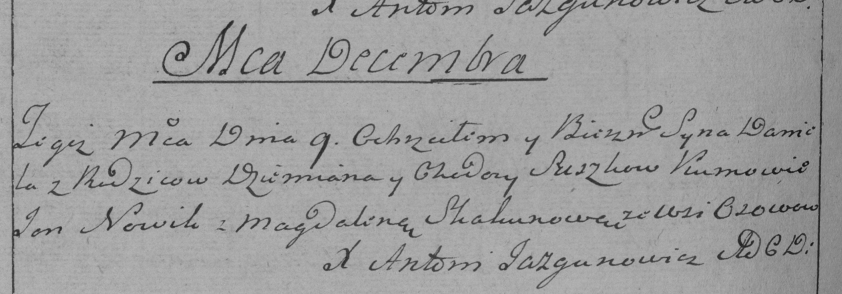
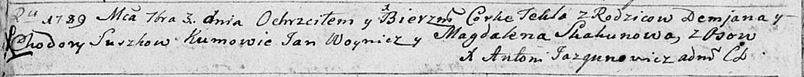

**Сушко Ходора (Suszkowa Chodora)**

9 декабря 1786 г -- крещение сына Данилы (РГИА 823-2-18, лист 232об,
№28/1786-р (коп)).

3 сентября 1789 г -- крещение дочери Текли (НИАБ 136-13-894, лист 7об,
№45/1789-р (ориг)).

**РГИА 823-2-18:** Лист 232об. **Метрическая запись №28/1786-р (коп).**

Дедиловичская Покровская церковь. 9 декабря 1786 года. Метрическая
запись о крещении.

Suszko Daniel -- сын родителей с деревни Осово.

Suszko Dzemian -- отец.

Suszkowa Chodora -- мать.

Nowik Jan -- кум.

Skakunowa Magdalena - кума.

Jazgunowicz Antoni -- ксёндз.

**НИАБ 136-13-894:** Лист 7об. **Метрическая запись №45/1789-р (ориг).**

Дедиловичская Покровская церковь. 3 сентября 1789 года. Метрическая
запись о крещении.

Suszkowna Tekla -- дочь родителей с деревни Осово.

Suszko Demjan -- отец.

Suszkowa Chodora -- мать.

Woynicz Jan - кум.

Skakunowa Magdalena - кума.

Jazgunowicz Antoni -- ксёндз.
