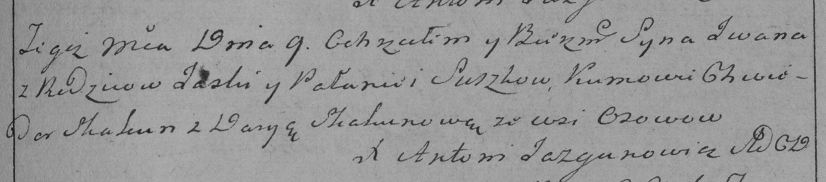

**Сушко Иван (Suszko Jwan)**

14 ноября 1787 г -- венчание с Полюхой Войнич (НИАБ 136-13-894, лист
66об, №13/1787-б (ориг)).

9 марта 1792 г -- крещение сына Василя (НИАБ 136-13-894, лист 15,
№12/1792-р (ориг)), (РГИА 823-2-18, лист 244, №6/1792-р (коп)).

**НИАБ 136-13-894:** Лист 66об. **Метрическая запись №13/1787-б
(ориг).**

{width="6.496527777777778in"
height="1.0989588801399826in"}

Дедиловичская Покровская церковь. 14 ноября 1787 года. Метрическая
запись о венчании.

Suszko Jwan -- жених с деревни \[Осово\].

Woyniczowna Polucha -- невеста.

Skakun Jhnat -- свидетель.

Woynicz Mikita -- свидетель.

Jazgunowicz Antoni -- ксёндз.

**НИАБ 136-13-894:** Лист 15. **Метрическая запись №12/1792-р (ориг).**

{width="6.496527777777778in"
height="0.5062314085739282in"}

Дедиловичская Покровская церковь. 9 марта 1792 года. Метрическая запись
о крещении.

Suszko Wasil -- сын родителей с деревни Осовo.

Suszko Jwan -- отец.

Suszkowa Pałanieja -- мать.

Skakun Chwiedor -- кум.

Skakunowa Daryia - кума.

Jazgunowicz Antoni -- ксёндз.

**РГИА 823-2-18:** Лист 244. **Метрическая запись №6/1792-р (коп).**

{width="6.496527777777778in"
height="1.43125in"}

Дедиловичская Покровская церковь. 9 марта 1792 года. Метрическая запись
о крещении.

Suszko \[Wasil\] -- сын родителей с деревни Осово.

Suszko \[Jwan\] -- отец.

Suszkowa Pałanieja -- мать.

Skakun Chwiedor -- кум.

Skakunowa Darya - кума.

Jazgunowicz Antoni -- ксёндз.
