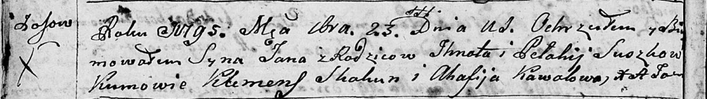
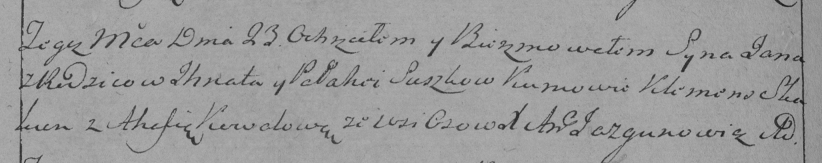

**Сушко Игнат (Suszko Jhnat)**

23 сентября 1795 г -- крещение сына Яна (НИАБ 136-13-894, лист 25об,
№38/1795-р (ориг)), (РГИА 823-2-18, лист 253об, №31/1795-р (коп)).

**НИАБ 136-13-894:** Лист 25об. **Метрическая запись №38/1795-р
(ориг).**

Дедиловичская Покровская церковь. 23 сентября 1795 года. Метрическая
запись о крещении.

Suszko Jan -- сын родителей с деревни Осовo.

Suszko Jhnat -- отец.

Suszkowa Pełahija -- мать.

Skakun Klemens - кум.

Kawalowa Ahafija - кума.

Jazgunowicz Antoni -- ксёндз.

**РГИА 823-2-18:** Лист 253об. **Метрическая запись №31/1795-р (коп).**

Дедиловичская Покровская церковь. 23 сентября 1795 года. Метрическая
запись о крещении.

Suszko Jan -- сын родителей с деревни Осово.

Suszko Jhnat -- отец.

Suszkowa Pełahia -- мать.

Skakun Klemens -- кум.

Kowalowa Ahafia -- кума.

Jazgunowicz Antoni -- ксёндз.
