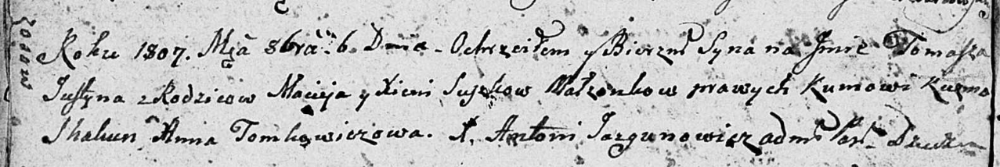

**Сушко Томаш Мацеев (Suszko Tomasz Justyn)**

6 октября 1807 г -- крещение (НИАБ 136-13-894, лист 63об, №41/1807-р
(ориг)).

**НИАБ 136-13-894:** Лист 63об. **Метрическая запись №41/1807-р
(ориг).**

{width="6.496527777777778in"
height="1.0889009186351706in"}

Дедиловичская Покровская церковь. 6 октября 1807 года. Метрическая
запись о крещении.

Suszko Tomasz Justyn -- сын родителей с деревни Осовo.

Suszko Maciey -- отец.

Suszkowa Xienia -- мать.

Skakun Kuźma -- кум.

Tomkowiczowa Anna -- кума.

Jazgunowicz Antoni -- ксёндз.
