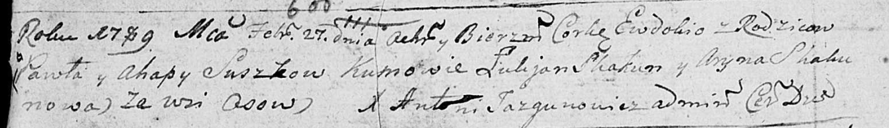
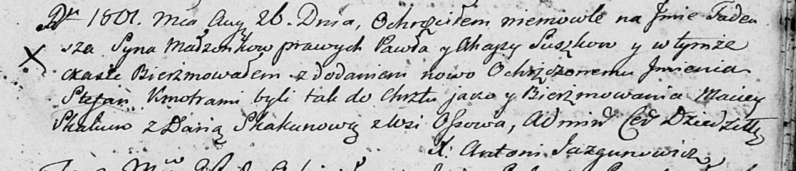

**Сушко Агапа (Suszkowa Ahapa)**

27 февраля 1789 г -- крещение дочери Евдокии (НИАБ 136-13-894, лист 6об,
№11/1789-р (ориг)).

26 августа 1801 г -- крещение сына Тадея Степана (НИАБ 136-13-894, лист
44, №19/1801-р (ориг)).

**НИАБ 136-13-894:** Лист 6об. **Метрическая запись №11/1789-р (ориг).**

Дедиловичская Покровская церковь. 27 февраля 1789 года. Метрическая
запись о крещении.

Suszkowna Ewdokia -- дочь родителей с деревни Осово.

Suszko Paweł -- отец.

Suszkowa Ahapa -- мать.

Skakun Łukjan - кум.

Skakunowa Aryna - кума.

Jazgunowicz Antoni -- ксёндз.

**НИАБ 136-13-894:** Лист 44. **Метрическая запись №19/1801-р (ориг).**

Дедиловичская Покровская церковь. 26 августа 1801 года. Метрическая
запись о крещении.

Suszko Tadeusz Stefan -- сын родителей с деревни Осовo.

Suszko Paweł -- отец.

Suszkowa Ahapa -- мать.

Skakun Maciey -- кум.

Skakunowa Daryia -- кума.

Jazgunowicz Antoni -- ксёндз.
