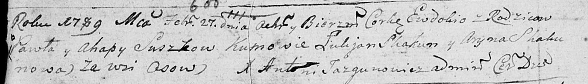

**Сушко Евдокия Павлова (Suszkowna Ewdokia)**

27 февраля 1789 г -- крещение (НИАБ 136-13-894, лист 6об, №11/1789-р
(ориг)).

**НИАБ 136-13-894:** Лист 6об. **Метрическая запись №11/1789-р (ориг).**

Дедиловичская Покровская церковь. 27 февраля 1789 года. Метрическая
запись о крещении.

Suszkowna Ewdokia -- дочь родителей с деревни Осово.

Suszko Paweł -- отец.

Suszkowa Ahapa -- мать.

Skakun Łukjan - кум.

Skakunowa Aryna - кума.

Jazgunowicz Antoni -- ксёндз.
