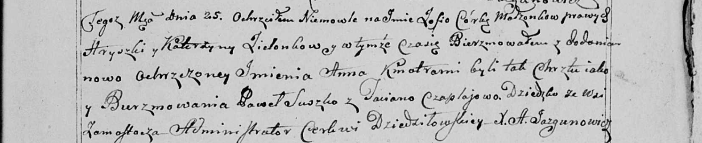

**Сушко Павел (Suszko Paweł)**

27 февраля 1789 г -- крещение дочери Евдокии (НИАБ 136-13-894, лист 6об,
№11/1789-р (ориг)).

25 ноября 1800 г -- кум при крещении дочери Зофии Анны Зелёнков Грышки и
Катерыны с деревни Замосточье (НИАБ 136-13-894, лист 42об, №33/1800-р
(ориг), НИАБ 136-13-949, лист 104, №36/1800-р (коп)).

26 августа 1801 г -- крещение сына Тадея Степана (НИАБ 136-13-894, лист
44, №19/1801-р (ориг)).

**НИАБ 136-13-894:** Лист 6об. **Метрическая запись №11/1789-р (ориг).**

{width="6.496527777777778in"
height="0.9407195975503062in"}

Дедиловичская Покровская церковь. 27 февраля 1789 года. Метрическая
запись о крещении.

Suszkowna Ewdokia -- дочь родителей с деревни Осово.

Suszko Paweł -- отец.

Suszkowa Ahapa -- мать.

Skakun Łukjan - кум.

Skakunowa Aryna - кума.

Jazgunowicz Antoni -- ксёндз.

**НИАБ 136-13-894:** Лист 42об. **Метрическая запись №33/1800-р
(ориг).**

{width="6.496527777777778in"
height="1.5656299212598426in"}

Дедиловичская Покровская церковь. 25 ноября 1800 года. Метрическая
запись о крещении.

Zielonkowna Zofia Anna -- дочь родителей с деревни Замосточье.

Zielonka Hryszka -- отец.

Zielonkowa Katerzyna -- отец.

Suszko Paweł -- кум, с деревни Осовo.

Czaplajowa Taciana -- кума, с деревни Осовo.

Jazgunowicz Antoni -- ксёндз.

**НИАБ 136-13-949:** Лист 104. **Метрическая запись №36/1800-р (коп).**

(См. тж.: НИАБ 136-13-894, лист 42, №33/1800-р (ориг))

{width="6.496527777777778in"
height="1.33125in"}

Дедиловичская Покровская церковь. 25 ноября 1800 года. Метрическая
запись о крещении.

Zielonkowna Zofia Anna -- сын родителей с деревни Замосточье.

Zielonko Hryszka -- отец.

Zielonkowa Katerzyna -- мать.

Suszko Paweł -- кум, с деревни \[Осовo\].

Czapłajowa Taciana - кума, с деревни \[Осовo\].

Jazgunowicz Antoni -- ксёндз.

**НИАБ 136-13-894:** Лист 44. **Метрическая запись №19/1801-р (ориг).**

{width="6.496527777777778in"
height="1.4053794838145233in"}

Дедиловичская Покровская церковь. 26 августа 1801 года. Метрическая
запись о крещении.

Suszko Tadeusz Stefan -- сын родителей с деревни Осовo.

Suszko Paweł -- отец.

Suszkowa Ahapa -- мать.

Skakun Maciey -- кум.

Skakunowa Daryia -- кума.

Jazgunowicz Antoni -- ксёндз.
