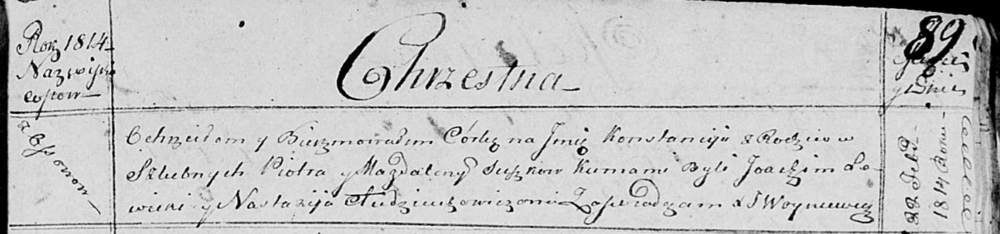

**Сушко Констанция Петрова (Suszkowna Konstancija)**

22 февраля 1814 г -- крещение (НИАБ 136-13-894, лист 89, №13/1814-р
(ориг)).

**НИАБ 136-13-894:** Лист 89. **Метрическая запись №13/1814-р (ориг).**

Осовская Покровская церковь. 22 февраля 1814 года. Метрическая запись о
крещении.

Suszkowna Konstancija -- дочь родителей с деревни Осовo.

Suszko Piotr -- отец.

Suszkowa Magdalena -- мать.

Sowicki? Joachim -- кум.

Audziuchowiczowa Nastazija -- кума.

Woyniewicz Tomasz -- ксёндз.
