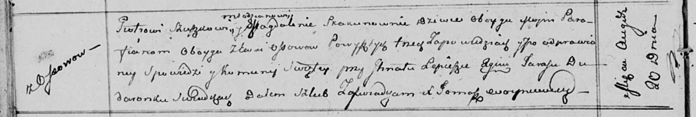
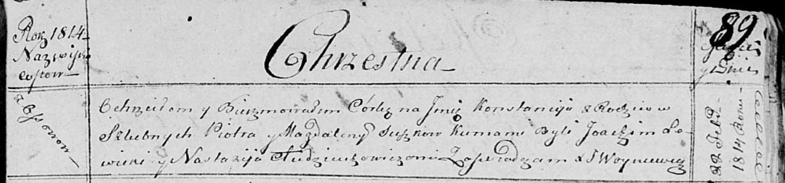

**Сушко Пётр (Suszko Piotr)**

20 августа 1811 г -- венчание с девкой Магдаленой Скакун с деревни Осово
(НИАБ 136-13-920, лист 17об, №4/1811-б (ориг)).

22 февраля 1814 г -- крещение дочери Констанции (НИАБ 136-13-894, лист
89, №13/1814-р (ориг)).

**НИАБ 136-13-920:** Лист 17об. **Метрическая запись №4/1811-б (ориг).**

Осовская Покровская церковь. 20 августа 1811 года. Метрическая запись о
венчании.

Szuszko Piotr -- жених, молодой, парафии Осовской, с деревни Осово.

Skakunowna Magdalena -- невеста, девка, парафии Осовской, с деревни
Осово.

Lаpieszko Jgnat -- свидетель.

Dudaronek Taras -- свидетель.

Woyniewicz Tomasz -- ксёндз.

**НИАБ 136-13-894:** Лист 89. **Метрическая запись №13/1814-р (ориг).**

Осовская Покровская церковь. 22 февраля 1814 года. Метрическая запись о
крещении.

Suszkowna Konstancija -- дочь родителей с деревни Осовo.

Suszko Piotr -- отец.

Suszkowa Magdalena -- мать.

Sowicki? Joachim -- кум.

Audziuchowiczowa Nastazija -- кума.

Woyniewicz Tomasz -- ксёндз.
