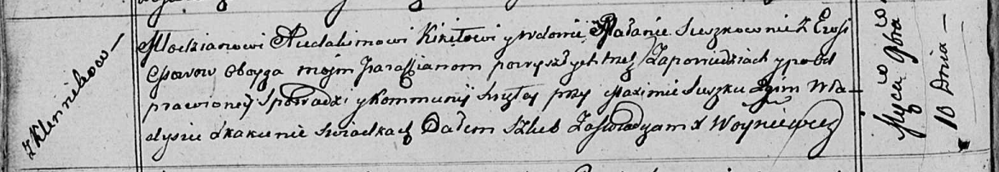

**Кикило (в предыдущем браке Сушко) Маланья, Мелания (Kikiłowa
(Suszkowna) Małanija, Mełanija)**

10 ноября 1812 г -- венчание с молодым Авдакимом Кикило с деревни
Клинники (НИАБ 136-13-920, лист 18об, №6/1812-б (ориг)).

**НИАБ 136-13-920:** Лист 18об. **Метрическая запись №6/1812-б (ориг).**

Осовская Покровская церковь. 10 ноября 1812 года. Запись о венчании.

Kikiło Audachim -- жених, молодой, парафии Осовской, с деревни Клинники.

Suszkowna Małania -- невеста, вдова, парафии Осовской, с деревни Осово.

Suszko Maxim -- свидетель.

Skakun Władyś -- свидетель.

Woyniewicz Tomasz -- ксёндз.
