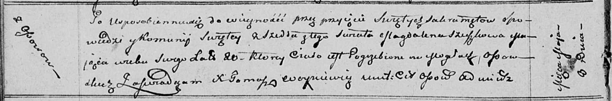

**Сушко Магдалена (Szuszkowa Magdalena)**

8 мая 1811 г -- отпевание, умерла в возрасте 20 лет (родилась около 1791
г) (НИАБ 136-13-919, лист 22об, №11/1811-у (ориг)).

**НИАБ 136-13-919:** Лист 22об. **Метрическая запись №11/1811-у
(ориг).**

Осовская униатская церковь. 8 мая 1811 года. Метрическая запись об
отпевании.

Szuszkowa Magdalena -- умершая, 20 лет, с деревни Осово, похоронена на
кладбище деревни Осово.

Woyniewicz Tomasz -- ксёндз.
