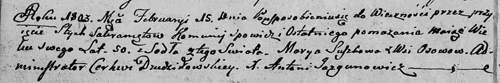

**Сушко Марыя (Suszkowa Marya)**

15 февраля 1803 г -- отпевание, умерла в возрасте 50 лет (родилась около
1853 г) (НИАБ 136-13-919, лист 13об, №3/1803-у (ориг)).

**НИАБ 136-13-919:** Лист 13об. **Метрическая запись №3/1803-у (ориг).**

Дедиловичская Покровская церковь. 15 февраля 1803 года. Метрическая
запись об отпевании.

Suszkowa Marya -- умершая, 50 лет, с деревни Осово.

Jazgunowicz Antoni -- ксёндз.
